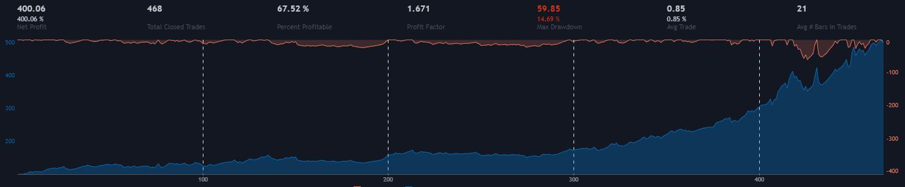

# Cryptocurrency Trader

[](https://forthebadge.com)
[](https://forthebadge.com)

This is a fairly simple cryptocurrency trading bot that is meant to be left running and will make you a profit over time. It has about a 65% win rate which means that it may make some losing trades but will still be profitable in the long run. This project is still *EXTREMELY* buggy and so I urge you to use this with care until I can polish it up a bit.



## Installation

You need to have a Binance spot trading account to use this project (I tried my best to avoid the image validation thing, try use 2FA).

1. Generate a Binance API and SECRET key

    **WRITE THESE DOWN IN A SAFE PLACE**. The secret key will not be visible if you come back to the page a second time

2. Pull this repository to your local machine (or wherever you want to run the bot)

    ```
    git clone https://github.com/andrewboyley/crypto-trader.git
    cd crypto-trader
    ```

3. Create a file called `.env`

    This is where you will store you keys. Make sure that this file is secure so that nobody can see it. Create two variables and insert your keys like this:

    ```
    API=YOUR-API-KEY-HERE
    SECRET=YOUR-SECRET-KEY-HERE
    ```

4. Install dependencies

    - [ ] Write a script and requirements.txt file to do this

    I know, I need to improve this. For now, make sure you do the following.

    1. Install TA-Lib for your OS

        Follow this instructions on the [TA-Lib website](https://www.ta-lib.org/) to install TA-Lib locally

    2. Install Python dependencies

        Install the following with a `pip install` command (requirements.txt coming soon)

        - numpy
        - matplotlib
        - TA-Lib
        - python-binance
        - python-dotenv
        - pandas
5. Customize your configuration

    Edit the `config.py` to your liking. You can modify the list of coins that the bot will monitor and change the time interval for the klines (although I have found that 30 minutes works best)

6. Start the bot

    - [ ] TODO: Make this into a Linux service so that it runs on boot
    
    ```
    python3 main.py
    ```
7. Invest into DOGE

    :gem: :hand: :rocket: :new_moon:

## Strategy

The bot has a relatively simple strategy that I have blatently stolen from a Trading View users Pine Script. I highly recommend that you check it out on [Trading View](https://www.tradingview.com/script/QoNKoXwW-Simple-profitable-trading-strategy/). Every 30 seconds, the bot will fetch the klines from Binance and compute the following:

- Exponential Moving Averages (8, 13, 21, 34 and 55)
- Relative Strength Index 14
- Stochastic

It will enter long if *all* of the following is true:

- Each EMA signal being larger than the next (ema8 > ema13, ema13 > ema21 etc)
- RSI < 65
- Stochastic < 80

It will exit this trade if *any* of the following is true:

- RSI > 70
- EMA21 < EMA55
- Stochastic > 95
